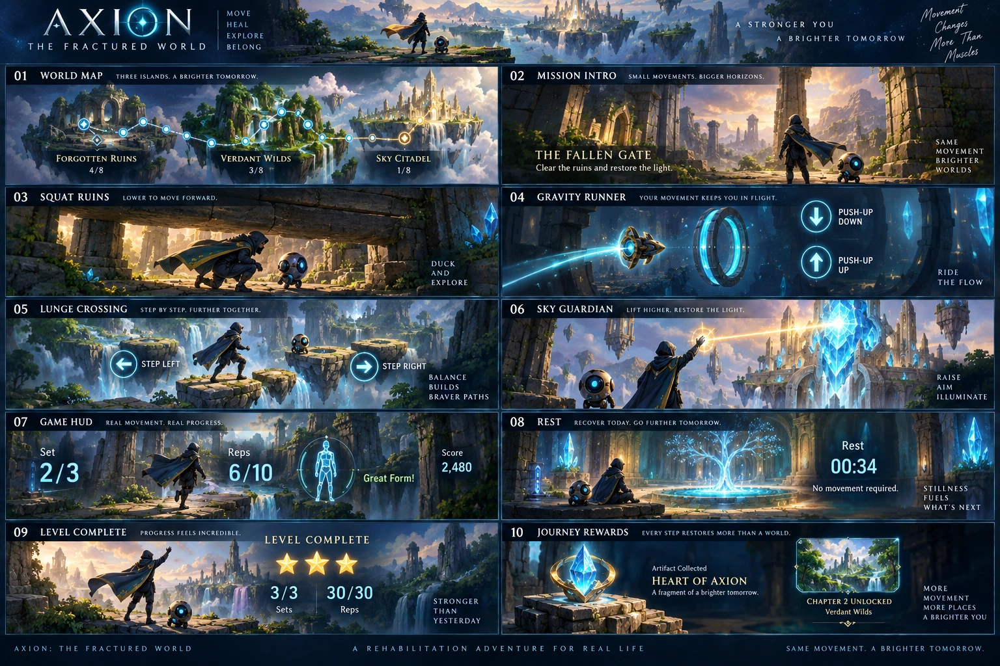

# Axion: The Fractured World

This change integrates four movement experiences into the existing Movement Science Lab, preserving the therapist's prescription and Supabase authorization model.

The design board includes the adventure map, mission entry, squat ruins, push-up gravity runner, lunge crossing, shoulder-light aiming, camera/form guidance, rest chamber, rewards and restored world. The references guide the fantasy presentation; all new scene and sprite artwork is original generated artwork, not extracted from Prodigy.

## Implemented controls

| Assignment | Scene | Input |
| --- | --- | --- |
| Bodyweight squat | Escape Through the Ruins | Knee excursion lowers the explorer under beams |
| Floor or wall push-up | Gravity Runner | Elbow excursion controls ship altitude |
| Supported forward lunge | Crossing the Verdant Wilds | Prescribed knee excursion and measured side guide the crossing |
| Standing shoulder abduction | Sky Guardian | Arm elevation controls a beam aimed at crystals |

`adventure-definitions.js` registers entertainment configuration. `motionInput` translates accepted tracker samples into bounded game input; it fixes the former `rep`/`reps` mode mismatch. `pose.js` retains clinical cycle detection and accepts a prescribed measurement side. `movement-game.js` owns entertainment state; `adventure-scene.js` lazily renders Canvas2D and cannot save or modify clinical repetitions. `main.js` coordinates the prescription, tracking, rest and save lifecycle. No additional game-engine dependency is required.

The revised brief explicitly takes precedence over the old collision rule: validated exercise reps always count. Collisions change game score, never clinical dosage. Only tracker completion events count; movement samples and incomplete cycles do not. Targets clamp at the prescribed total. Pausing, safety reporting, lost tracking and set breaks stop interaction; switching views or restarting cannot skip a scheduled break. Completed reps survive collisions. Holds reset their measured timer between prescribed sets.

Three narrative sections scale with completion percentage. Each game reports optional stars and artifact progress. The existing roadmap unlock/50-XP transaction remains authoritative. Gameplay summaries live under `movement_summary.adventure`; partial sessions do not unlock nodes. No bonus clinical repetitions are requested for collectibles.

## Prescription and persistence

Migration `202609050002_fractured_world.sql` adds `prescribed_side`, registers floor push-ups, extends the game allowlist and exposes `publish_patient_plan_v6`. It delegates to existing v5/v4/v3 authorization and dosage validation. It also prevents partial sessions from completing roadmap nodes. Existing clinical records are not rewritten.

The therapist picker uses the existing combined predicate and actual DOM `hidden` state. Rows now use a div rather than nested labels, so selecting dosage/rest controls cannot accidentally toggle the exercise. The empty-state CSS and game-container CSS explicitly override legacy compact-widget styles. Returning to a patient tab refreshes its authorized workspace.

## Validation performed (2026-09-05)

- `npm run check`: syntax, 93 exercise profile coverage, rep detectors, game boundaries, dose/rest boundaries, filter combinations and 212 existing smoke markers.
- Production Vite build passes. No TypeScript compiler or standalone lint configuration exists in this JavaScript repository; syntax checks are used rather than claiming a type-check run.
- Transactional Supabase integration test passes with synthetic fixtures and rollback: v6 mode/rest publication, partial-dose rejection, full holds/reps, locked nodes, one-time XP, cross-patient isolation, duplicate saves, revoked sessions and therapist MFA.
- Browser tested the actual prescription picker in a development fixture: 93 total, ankle 11, ankle plus “heel” 2, incompatible band filter 0, clear 93, game-supported filter 5; draft choices remain selected; rest toggle enables its field.
- Browser rendered all four scene variants. Simulated controls verify invalid reps remain uncounted and the 15-second rest blocks additional reps and mode-switch bypass. Canvas drawing was approximately 0.12 ms/frame in the cloud browser; this is renderer time only, not pose inference or a mobile performance claim.
- Local test routes bypass auth initialization, disable publishing and do not import any patient save API in the game playtest. Production builds remove the development picker branch and do not include the playtest entry.
- Supabase security advisor has no new RLS findings. Existing warning: leaked-password protection remains disabled in Auth.

## Release acceptance still required

The cloud browser exposes no camera. Real-camera exercise tracking, physical-device frame rate, camera placement, unilateral side accuracy and clinician suitability are **not verified** by synthetic/browser checks. In particular the floor push-up detector measures an elbow cycle, not full-body alignment; knee-side measurement is not a validated front-leg classifier. These must be evaluated on the intended devices before treating this as clinically validated software. Game input is clamped to the existing calibrated-baseline excursion profile; there is no new clinician ROM-measurement system.

The current slice is illustrated Canvas2D, not a 3D exploration engine. The lunge and shoulder scenes share the event controller but render distinct movement mechanics. The repository's existing bundle-size warning remains; the game renderer is lazy-loaded and the two optimized WebP atlases total under 900 KB.

## Local playtesting

Run the normal Vite development server and open `/playtest.html` for the isolated scene controller, or `/?prescription-playtest` for the actual picker with synthetic patient options and publishing disabled. Neither route grants access to patient data or appears in the production build. Browser tooling in this environment uses `sites-preview start /workspace/sites/axion`.

## Adding a supported game

1. Establish and test the exercise-specific tracker profile first.
2. Register its control, scene and narrative in `adventure-definitions.js`.
3. Add a renderer branch or separate renderer module without access to clinical/save state.
4. Extend the server-side allowlist in an additive migration; preserve the authenticated therapist relationship and MFA checks.
5. Cover invalid movement, pauses, collisions, final-dose stopping and persistence. Verify real camera input on target devices before release.

## Artwork provenance

Generated with OpenAI image generation for this implementation, then encoded as WebP:
- Design board: ten coordinated fantasy rehabilitation interface sketches.
- Environment atlas: 2×2 original ruins, gravity corridor, river wilds and sky sanctuary scenes, no embedded UI text.
- Transparent sprite atlas: explorer idle/duck/jump, gravity ship, beam, portal, crossing stone and crystal.

These assets are versioned with the application. Reduced-motion preferences disable ambient effects; renderer cost can suppress particles. Sound is opt-in.

## Live-camera squat update — 2026-09-06

Squats now use the actual mirrored camera image as the player, with a perspective
light gate overlaid on the same contained video coordinate system. The former
explorer remains only in the other existing exercise scenes. No video or landmark
frames are uploaded. Gate approach follows squat excursion, with no countdown or
extra range requirement. The first detector-validated prescribed rep calibrates
camera head clearance and excursion; subsequent smaller valid ranges ease the
opening rather than increase required movement. Tracking loss withdraws the gate;
returning to neutral re-establishes the standing reference. Clinical counting stays
with the existing movement detector, independent of game score.

Real labs and saves require an active assignment on the signed-in patient's active
plan and care connection. Anonymous lab entry opens sign-in. Assignment mode,
sets, repetitions, rest and game results already live in exercise_assignments and
patient-owned exercise_sessions; no separate public/global game record or new
schema is needed. Saved mission history is shown on the corresponding patient's
exercise card. Database RLS is authoritative beyond the frontend ownership guard.
Adventure summaries use version 2 and identify the live_camera perspective.

Camera restarts release the previous stream/animation loop. An operation generation
prevents a delayed permission or model response from starting a departed session.
Backgrounding the page pauses tracking and requires an explicit resume.

Verification: npm run check (including camera-coordinate, gate, stale-pose,
invalid-rep, pause, dose-cap and ownership tests), production build, browser preview
and anonymous-entry checks, and the transactional Supabase RLS integration suite
passed. Synthetic database rows were rolled back. No physical camera is available
in the cloud browser. Real-device acceptance remains required: side-view camera
setup, low light and occlusion, slow and small prescribed squat ranges, mobile
orientation changes, repeated camera restarts, and two authenticated patient
accounts completing/saving sets with therapist-prescribed rest. This release does
not claim clinical validation or perfect tracking across devices.

## Session lifecycle hardening — 2026-09-06

Reset now clears the detector's previous calibration and resumes an available
camera after a completed or paused session. Rest expiry respects a background-tab
pause even if the patient returns before the timer finishes; explicit Resume is
required. A failed inference/render frame releases the stream and failed model,
withdraws movement feedback, and offers a camera restart while retaining completed
repetitions.

The automated tracker lifecycle suite invokes the real createMovementTracker
implementation with deterministic media/model doubles (no network or clinical
data). It verifies stable-stance calibration, reset/recalibration, pause/resume,
one tracking loop after restart, previous stream release, inference failure and
recovery, and cancellation of a delayed camera grant after exit. This complements
rather than replaces physical-camera and authenticated patient acceptance testing.
